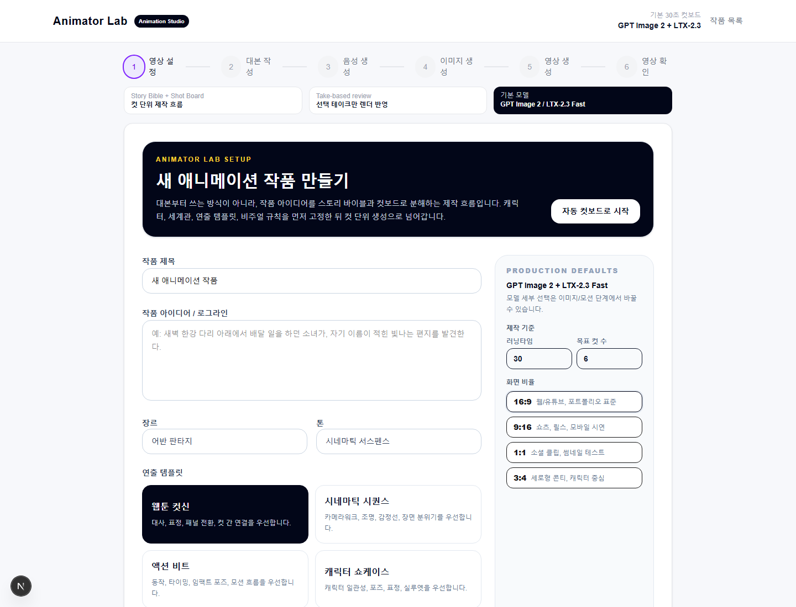
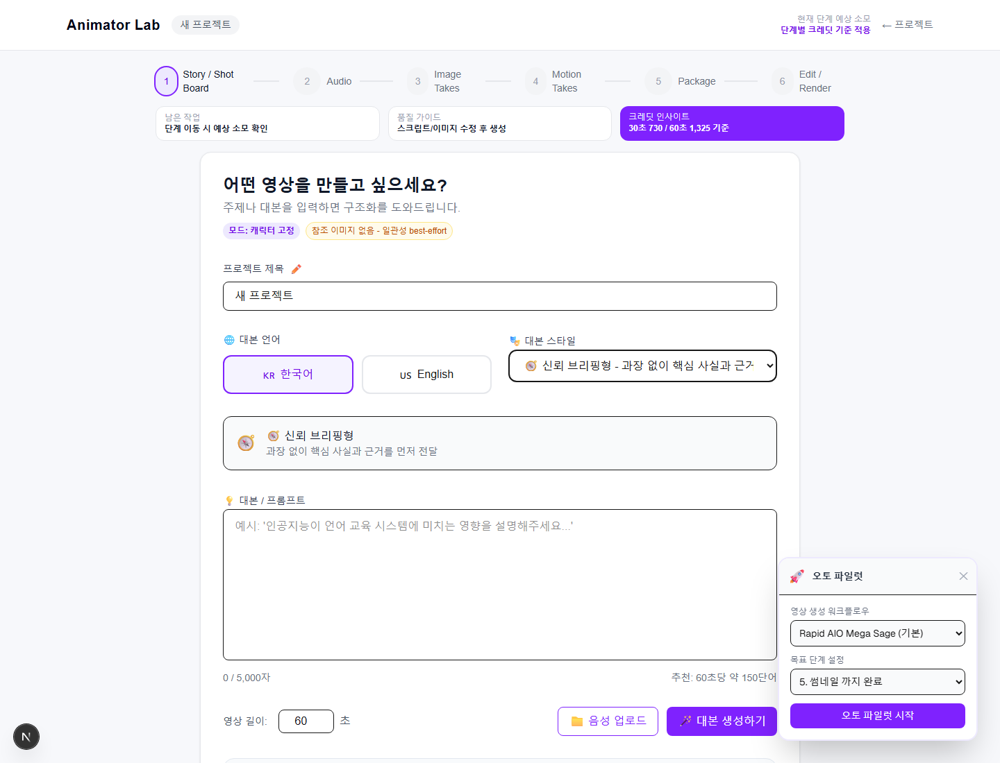
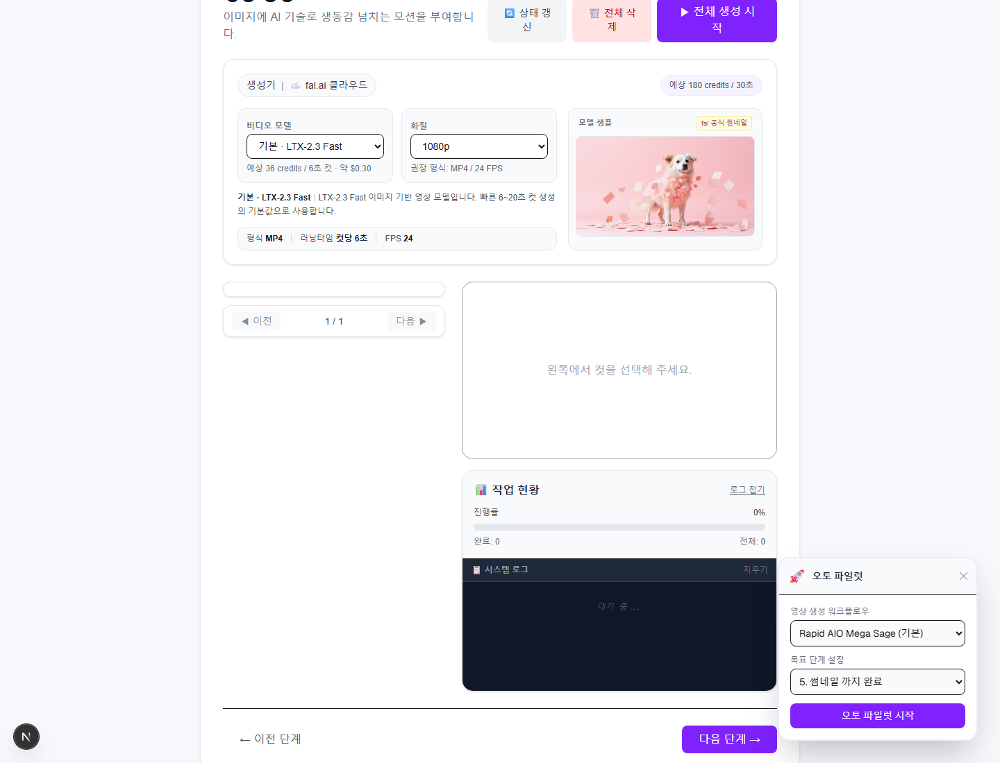
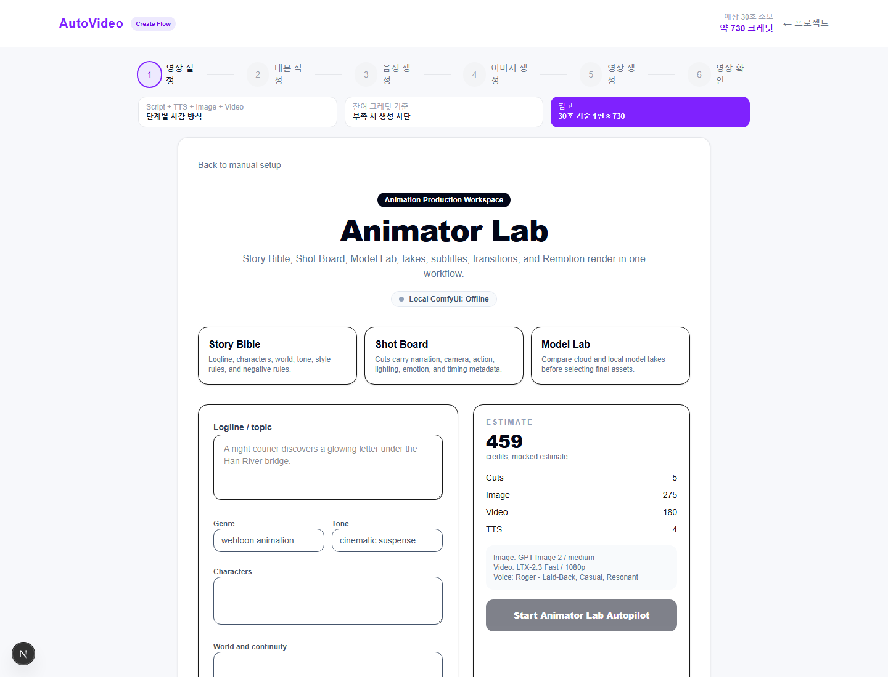
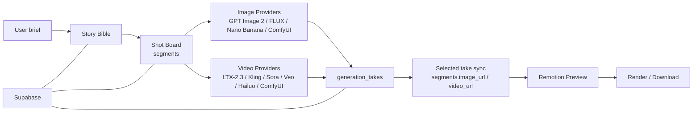

# Animator Lab

AI 애니메이션 제작을 위한 **story bible → shot board → model lab → take selection → Remotion render** 워크플로우 실험 프로젝트입니다.

기존 숏폼 자동 생성 앱을 포크해, 네이버웹툰 AI Animator 직무에서 요구하는 컷 단위 연출 설계, 프롬프트 디렉팅, 모델 비교, 재생성 결과 관리 흐름에 맞게 재구성했습니다.

[36초 데모 영상 보기](portfolio/assets/animator-lab-demo.mp4)



## Why

생성형 AI 영상 제작에서 어려운 지점은 단순히 이미지를 한 장 뽑는 것이 아니라, **서사와 연출 의도를 여러 컷에 걸쳐 일관되게 유지하고 실패한 결과를 빠르게 비교/선택하는 것**입니다.

Animator Lab은 이 문제를 다루기 위해 다음 질문에서 출발했습니다.

- 주제를 바로 영상 생성 프롬프트로 보내지 않고, 먼저 작품 기준서를 만들 수 있을까?
- 각 컷의 대사, 화면, 카메라워크, 액션, 조명, 감정을 따로 통제할 수 있을까?
- 여러 이미지/영상 모델의 결과를 take로 보관하고 선택한 결과만 렌더에 반영할 수 있을까?
- cloud 모델과 로컬 ComfyUI 워크플로우를 같은 UI에서 비교할 수 있을까?

## Demo Screens

| New Work | Shot Board |
|---|---|
|  |  |

| Motion Takes | Autopilot |
|---|---|
|  |  |

## Core Features

- **Story Bible**: 로그라인, 장르, 톤, 캐릭터, 세계관, 스타일 규칙, 금지 요소를 작품 단위로 관리
- **Shot Board**: 기존 `segments` 구조를 컷으로 재해석하고 대사, 화면 설명, 카메라워크, 액션, 조명, 감정, negative prompt를 편집
- **Take System**: 이미지/영상 생성 결과를 `generation_takes`로 보관하고 선택된 take만 `segments.image_url` / `segments.video_url`에 동기화
- **Model Lab**: GPT Image 2, Nano Banana, FLUX.2, LTX-2.3 Fast, Seedance, Kling, Sora, Veo, Hailuo, Local ComfyUI 옵션을 같은 구조로 비교
- **Local ComfyUI Option**: `COMFYUI_BASE_URL`이 있으면 로컬 모델을 표시하고, 꺼져 있으면 Offline 상태로 비활성화
- **Render Compatibility**: 기존 Remotion preview/render 구조를 유지해 자막, 전환, 오디오 합성 흐름을 계속 사용
- **Mock-first Tests**: 유료 API 호출 없이 model registry, payload mapping, Animator Lab API 흐름을 Playwright로 검증

## Architecture



More detail: [docs/ARCHITECTURE.md](docs/ARCHITECTURE.md)

## Tech Stack

- **App**: Next.js 16 App Router, React 19, TypeScript
- **Database / Storage**: Supabase
- **Image Models**: fal-hosted GPT Image 2, Nano Banana, FLUX.2, optional Local ComfyUI
- **Video Models**: LTX-2.3 Fast, Seedance, Kling v3, Sora 2, Veo 3.1 Fast, Hailuo, optional Local ComfyUI
- **TTS**: ElevenLabs Flash v2.5
- **Render**: Remotion
- **Testing**: Playwright mocked E2E, TypeScript build checks

## Run Locally

```bash
npm install
cp .env.example .env.local
npm run dev
```

Open [http://localhost:3000](http://localhost:3000).

For a dev-only bypass during local UI review:

```text
http://localhost:3000/create/new?testDashboard=1
```

## Environment

Use [.env.example](.env.example) as the template. The app can boot with placeholders, but real generation needs provider keys.

Required for normal app data:

- `NEXT_PUBLIC_SUPABASE_URL`
- `NEXT_PUBLIC_SUPABASE_ANON_KEY`
- `SUPABASE_SERVICE_KEY`

Required for cloud generation:

- `GOOGLE_AI_API_KEY`
- `FAL_KEY`
- `ELEVENLABS_API_KEY`

Optional:

- `COMFYUI_BASE_URL`
- OAuth provider keys
- Telegram bot variables

## Database

Apply the migrations in [supabase/migrations](supabase/migrations). The Animator Lab-specific migration is:

```text
supabase/migrations/20260620_add_animator_lab.sql
```

It adds:

- `projects.story_bible`
- `projects.production_mode`
- shot metadata columns on `segments`
- `generation_takes`

The app also includes a legacy-schema fallback so project creation still works before the latest migration is applied.

## Verification

```bash
npx tsc --noEmit
npm run build
npm run test:e2e
```

Real provider smoke tests are intentionally separate because they call paid APIs.

## Portfolio Notes

- Screenshots and demo assets use dummy/original project data.
- Paid generation is not required to understand the repo structure.
- The current focus is workflow design and orchestration, not production auth/billing hardening.
- Public docs intentionally avoid API keys, real user data, and private session logs.
